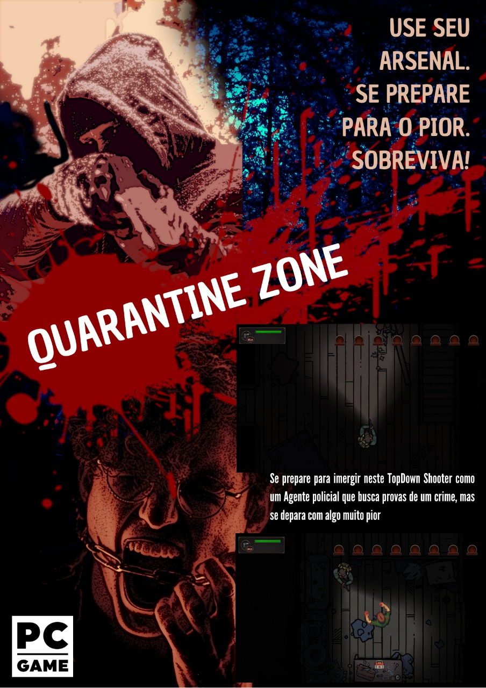

# QUARANTINE ZONE

## **Criadores**

Gilmar Correia Jeronimo        - RA: 11014515

Ivan Correia Lima Coqueiro     - RA: 11026416

Lucas Barboza Moreira Pinheiro - RA: 11017015

## **Descrição:** 

Se prepare para imergir neste TopDown Shooter como um Agente policial que busca provas de um crime, mas se depara com algo muito pior. Baixe o jogo em: https://github.com/lucaslbmp/Shoot-Game/releases/tag/v.1 ou jogue online em https://gilmarcorreia.itch.io/quarantine-zone

## **Banner:**

## **Link YouTube:**

### Gameplay 1

### Gameplay 2

## DESCRIÇÃO DE ATIVIDADES

### Gilmar 

- Mapa do jogo. 
- Collider de objetos.
- Iluminação do mapa do jogo.
- Level design.
- Programação do jogo.

### Ivan

- Design do Som.
- Folder para o Jogo.
- Menu do jogo e cena de Créditos.
- Animações dos objetos.
- Programação do jogo.

### Lucas

- Game design.
- Animações dos player.
- Animações dos inimigos.
- Lógica do jogo.
- Programação do jogo. 
